# Retail Industry Sales Optimization using Promotion Event Analytics

As a Data Analyst working for a multi-city retail chain in India, I was assigned to evaluate the effectiveness of promotional campaigns conducted during major festive events. The company operates across multiple cities and runs targeted promotions such as percentage discounts, Buy One Get One Free offers, and cashback incentives to drive revenue and customer engagement.

The objective of this analysis was to determine:
- Which promotional strategies maximize revenue?
- Which campaigns drive higher sales volume?
- Which product categories respond best to promotions?
- How do different cities perform during events?

The business operates on a high-volume retail model where strategic discounting during festive events plays a critical role in achieving growth targets.

Insights and recommendations are provided on the following key areas:
- Campaign Performance
- Promotion Type Effectiveness
- Product & Category Performance
- Regional Performance

**SQL Queries** – [Click Here](sql) 

**Juppyter Notebooks** – [Click Here](jupyter_notebook) 

**Interactive Power BI Dashboard** – [Click Here](https://app.powerbi.com/view?r=eyJrIjoiMTA0MGU0ZTEtZjA0Yy00Yzg4LTgwN2YtMTlmMTc5Mjk4NTRjIiwidCI6ImM2ZTU0OWIzLTVmNDUtNDAzMi1hYWU5LWQ0MjQ0ZGM1YjJjNCJ9)  

---

## Data Structure and Preparation  

The database consisted of **4 tables**:  
- **dim_campaigns** – campaign details  
- **dim_products** – product details
- **dim_stores** – store details
- **fact_events** – event sale details

 
**Entity Relationship Diagram (ERD)**  
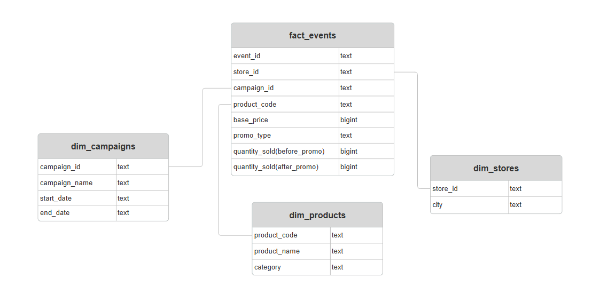  

### Data Cleaning & Preparation  
Data cleaning was performed using **Python (Pandas) in Jupyter Notebook**.

Key steps included:
- Removing duplicate records
- Standardizing promo type naming conventions
- Correcting inconsistent data types
- Flagging & handling null values
- Treating outliers
- Validated revenue and quantity consistency

These steps ensured analytical consistency and improved data reliability.

---

## Executive Summary  

### Key Findings  
If stakeholders were to take away three key insights from this project, they would be:
- **Buy One Get One Free** and **Cashback** promotions significantly outperform percentage-based discounts in both revenue growth and sales volume uplift.
- One festive campaign drives stronger revenue growth (Diwali Campaign), while the other drives higher sales volume growth (Sankranti Campaign) — indicating different consumer buying behaviors.
- Not all product categories respond equally to heavy discounting; some categories generate revenue loss when discounts are too aggressive.

Overall, promotions successfully increased revenue and sales across all cities, but optimization of discount structure is critical for margin protection.

**Dashboard Preview** 

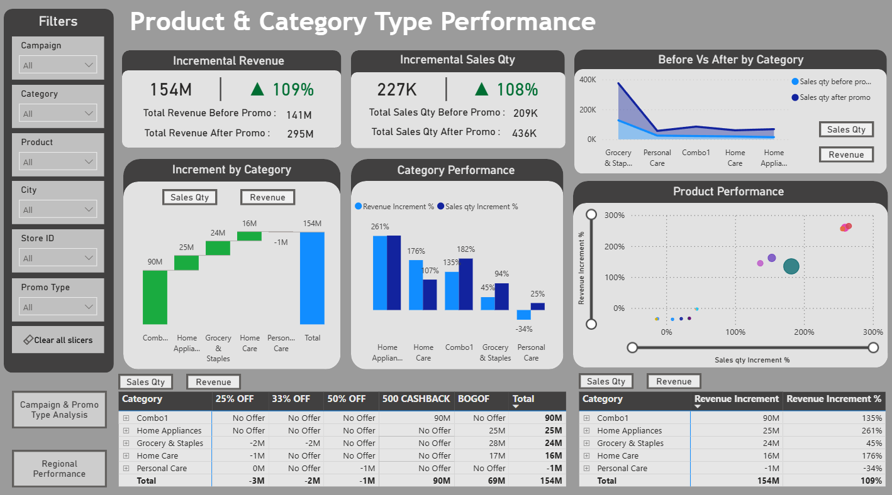  

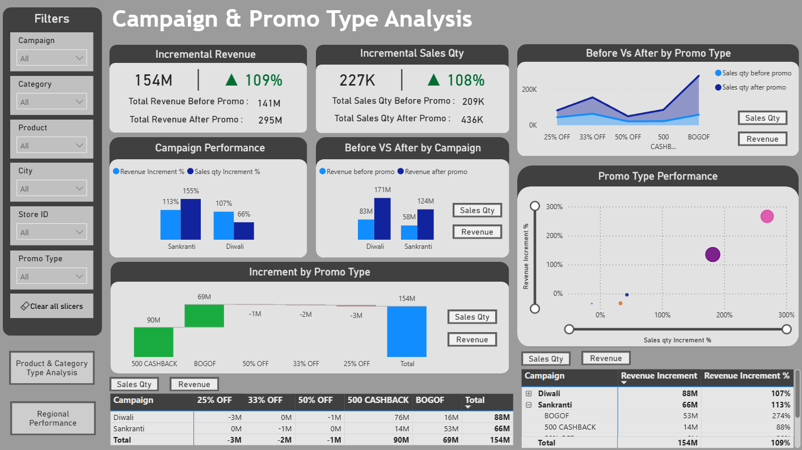  

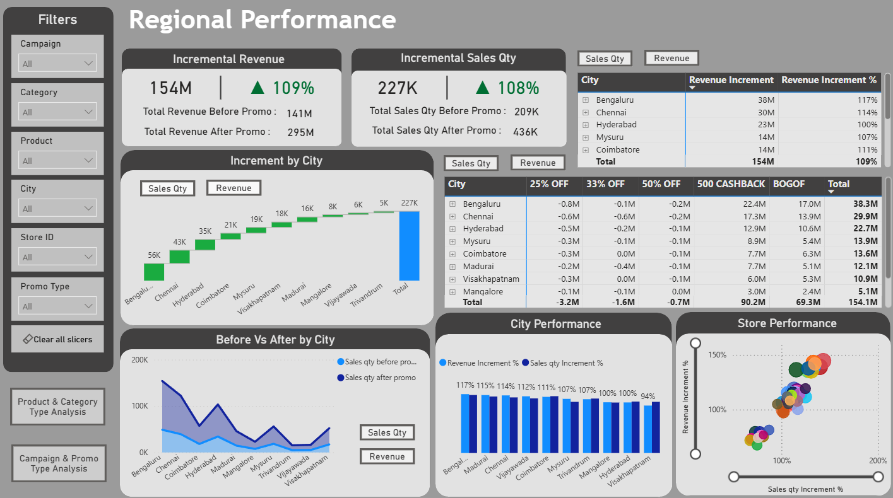  

---

## Insights Deep Dive  

### 1. Campaign Performance

**Main Insight 1**

Strong Overall Growth

- Revenue Before Promotion: 141M
- Revenue After Promotion: 295M
- Incremental Revenue: 154M (109% growth)
- Sales Quantity Before: 209K
- Sales Quantity After: 436K
- Incremental Sales Quantity: 227K (108% growth)

Both campaigns generated significant uplift in revenue and sales volume.

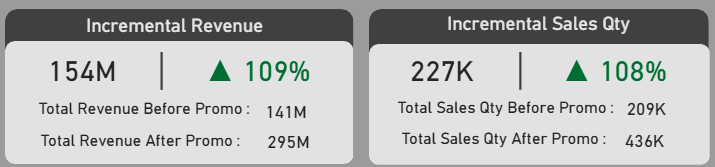 

**Main Insight 2**

Revenue vs Volume Dynamics
- Campaign A **(Diwali)** generated higher revenue growth.
- Campaign B **(Sankranti)** generated higher sales quantity growth.

This suggests:
- One event drives premium spending.
- The other drives high-volume purchasing behavior.

So, different campaigns require different optimization strategies:
- Revenue-focused event → Premium pricing & combo bundling
- Volume-focused event → Margin-protected volume incentives

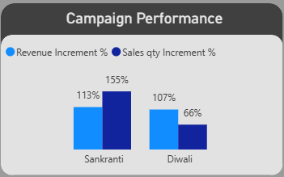 

**Main Insight 3**

Revenue Growth Outpaced Baseline
All campaigns showed more than 100% improvement compared to pre-promotion baseline revenue as well as sales volume, indicating strong promotional effectiveness. 

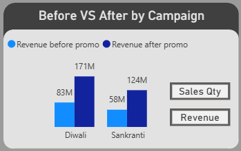

---

### 2. Promotion Type Effectiveness

**Main Insight 1**

Buy One Get One Free is the Top Performer

- Revenue Increment %: 266%
- Sales Quantity Increment %: 269%

Drives both volume and revenue simultaneously.

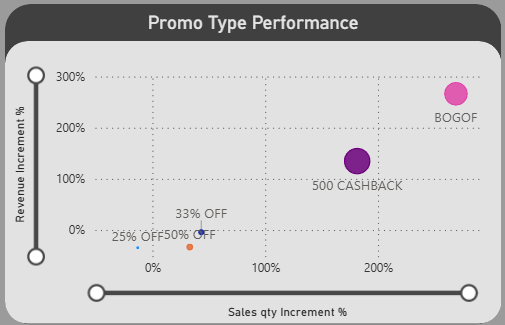

**Main Insight 2**

Mixed Performance betwen different Promo Types

- Cashback Offers Drive High Revenue
 - Revenue Increment: 90M
 - Strong positive performance across campaigns
 - Effective for revenue expansion without extreme discount depth

- 25% Discount Underperforms
 - Negative revenue growth
 - Negative sales quantity growth
 - Indicates poor price-discount balance

- 33% and 50% discounts increased sales volume in some cases, but revenue impact remained negative due to excessive discounting. This indicates deep discounts can hurt margins.

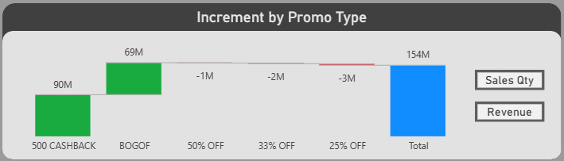

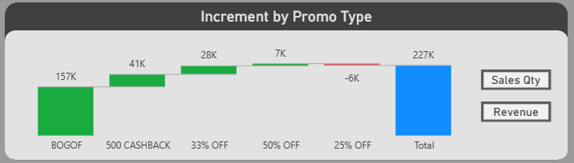

---

### 3. Product & Category Performance

**Main Insight 1**

High-Growth Categories
- Combo-based products generated the highest revenue growth.
- Grocery & Staples generated the highest volume growth.

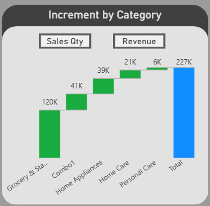

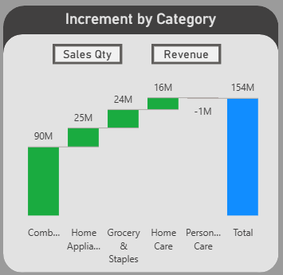

**Main Insight 2**

Home Appliances show strong ROI while Personal Care category underperforms in both revenue and sales volume

- Home Appliances category showed exceptional percentage growth in both revenue and sales volume, especially under BOGOF offers.
- Heavy discounting led to negative revenue growth despite a moderate sales increase in Personal Care category, which indicates margin erosion risk.

This suggests not all categories should receive the same discount structure. Category-based optimization is required.

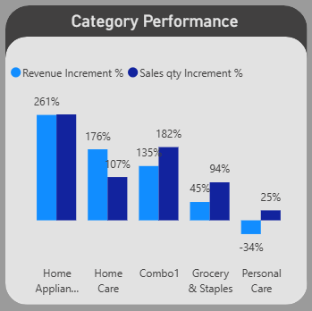

---

### 4. Regional Performance

**Main Insight 1**

All Cities Show Positive Growth
- Every city recorded revenue and sales growth compared to baseline.
- Major metro cities contributed the largest absolute revenue uplift.
- Smaller cities recorded strong percentage growth, indicating campaign scalability.
- Promotional campaigns can be scaled further in lower-performing cities with targeted marketing.

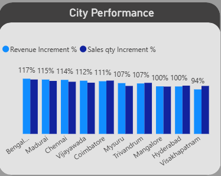

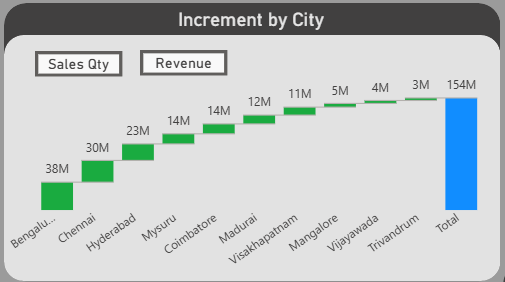

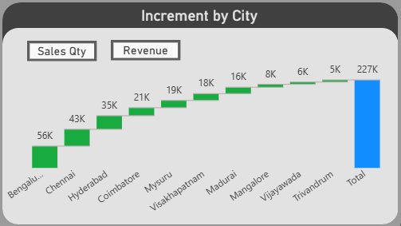

---

## Recommendations  
Based on the insights above, the Marketing & Strategy team should consider:
- Prioritizing Buy One Get One Free and Cashback promotions.
- Eliminating or redesigning 25% discount strategy.
- Reducing excessive deep-discount offers (33% & 50%) to protect margins.
- Implementing category-specific promotional strategies.
- Leveraging revenue-focused campaigns for premium pricing strategies.
- Using volume-driven campaigns for customer acquisition.
- Expanding promotional marketing in emerging cities.

---

## Assumptions & Caveats  
- Revenue comparisons are based strictly on before vs after promotion windows.
- Long-term customer lifetime value impact is not considered.
- External market factors were not included.
- Outliers were treated using statistical thresholds.
- Data cleaning assumptions were applied to standardize promo types and correct inconsistencies.

---

## Tools Used  
- Python (Pandas, NumPy, Matplotlib, Seaborn)
- Jupyter Notebook
- PostgreSQL
- Power BI

---

## Project Outcome  
This project demonstrates:
- End-to-end data cleaning & transformation
- SQL-based business querying
- KPI creation & metric design
- Executive-level dashboard storytelling
- Strategic product recommendation

The analysis shows the impact and performance of promotions in retail or multi-chain stores in the Retail industry.
